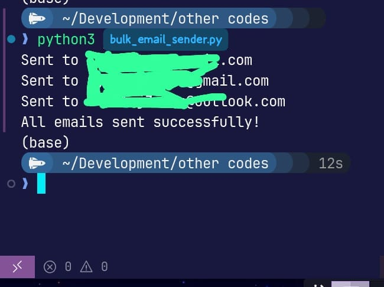

# Bulk Email Sender using Python and Gmail SMTP

This project is a **Python script for sending bulk emails (up to 100 recipients)** using **Gmail SMTP** with **TLS encryption** and a **Google App Password** for secure authentication.

---

## Features
- Sends **individual emails** to each recipient (privacy-friendly).
- Uses **Gmail SMTP (smtp.gmail.com:587)** with `starttls()` for security.
- Supports **Google App Password** authentication (required for Gmail).
- Adds **rate limiting** (`time.sleep`) to prevent Gmail from blocking you.
- Simple **plain-text email body** (customizable for personalization).

---

## Requirements
- Python 3.x
- Gmail account with:
  - **2-Step Verification enabled**
  - **App Password generated** (16 characters, e.g., `xxxx xxxx xxxx xxxx`)

---

## Setup
1. **Clone or copy this script.**
2. Install Python (3.8+ recommended).
3. Add your Gmail SMTP credentials and recipient list in the script:
   ```python
   SMTP_SERVER = "smtp.gmail.com"
   SMTP_PORT = 587
   FROM_EMAIL = "your-email@gmail.com"
   USERNAME = "your-email@gmail.com"
   PASSWORD = "your-app-password"

    recipients = [
        "user1@example.com",
        "user2@example.com",
        # up to 100 recipients
    ]

## Example Screenshot



## Run the Script
python bulk_email_sender.py

## Gmail Sending Limits

500 emails per day (for regular Gmail accounts).

100 recipients per email maximum.

Avoid sending too fast — keep time.sleep(1-2 seconds) between emails.

## Notes

Emails may land in Spam if you don't have SPF/DKIM set for your domain.

For production or high-volume sending, consider using SendGrid, Mailgun, or Amazon SES.